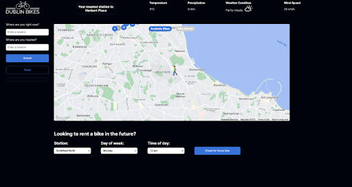
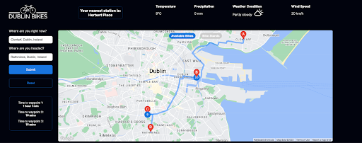
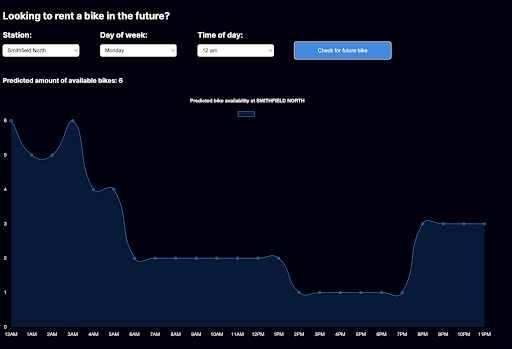
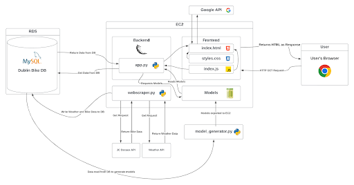

# About The Project #

This project aims to provide an alternative web application to the default web service provided
by Dublin Bikes. While the default application provides information on bike availability it still
lacks additional features such as weather information, a journey planner and bike availability
prediction. 

This application integrates real time occupancy data for Dublin Bikes and offers a more comprehensive and interactive platform to users to plan their cycling journeys throughout Dublin.

# Technology Stack # 

1. Backend: The backend is developed using Python and leverages Flask as its framework. Our backend handles client-side fetch requests, data manipulation, the reading of model files, and handles general server-side logic. It renders the default html page that is returned to the user on their browser when they attempt to access our site.

2. Frontend: The frontend is built using HTML, CSS, and JavaScript. It also makes use of  external libraries such as Chart.js for data visualisation and Google APIs for map integration and geolocation services.

3. Data Scraping: To enable automated data collection relevant to our application (bike availability data, weather data), we utilised Crontab to schedule the execution of the web scraper on an EC2 instance. Enabling crontab ensured that the web scraper ran seamlessly and reliably 24/7, enabling us to gather data consistently and without interruption.

4. Data Analytics: This application uses machine learning models for predicting bike availability and occupancy based on weather patterns and historical bike usage. These models are trained on the data collected by our web scraper and implemented using Python libraries, namely scikit-learn and pandas.

5. External Data Sources: Our application relies on data captured and hosted by two external service providers: JCDecaux and WeatherAPI. Our weather data is captured from weatherapi.com’s API, while our bike station information comes from JCDecaux API.

6. Hosting and Deployment: The web application is hosted on an Amazon EC2 instance. The scraped data is stored in an Amazon RDS database, ensuring efficient data management and retrieval. Gunicorn and Nginx were used to launch the web app, enabling efficient load balancing, reverse proxying, and improved performance. 

# Architecture #

# App Structure #

The web application is designed as a single-page application with a simple user-focused interface, featuring:

1. A search bar and journey planner on the left-hand side of the screen for easy access and navigation, streamlining users' search for bike stations and route planning.
   
2. A responsive map occupying the majority of the screen, displaying bike stations with markers for quick reference, and allowing users to zoom in or out for a detailed or broader view.
   
3. A header containing the application logo and a weather widget displaying the current weather information for Dublin, ensuring users have essential information at a glance.
   
4. Graphs that display historical and predictive bike occupancy data below the map.

# Features #

1. Real-time accurate information: The app delivers up-to-date occupancy, bike availability, and weather data, ensuring users have access to the most relevant and timely information.

2. Journey Planning: Help users effectively plan their trips using the bike-sharing system. Users can input their starting point and desired destination. The journey planner then computes the best route based on the users' preferences and current conditions.

3. Machine learning-powered predictions: The app employs machine learning models to predict bike occupancy based on weather patterns and historic bike station data, giving users the ability to make better-informed decisions and promoting efficient bike-sharing practices.

4. User based geolocation: shows the nearest station to the user currently on the map. The user’s location is a person walking and the nearest station is displayed as a person on a bicycle. Text for the nearest station is shown above the map.
